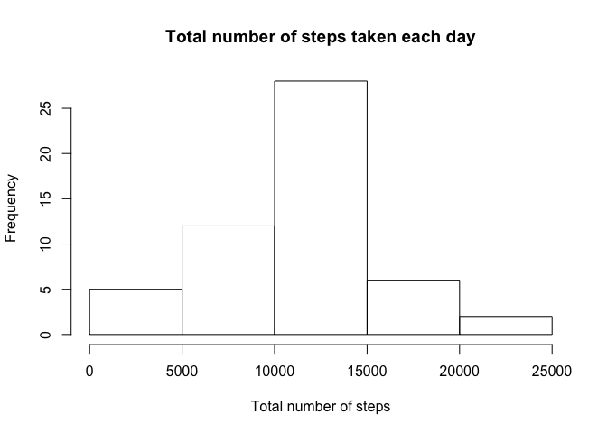
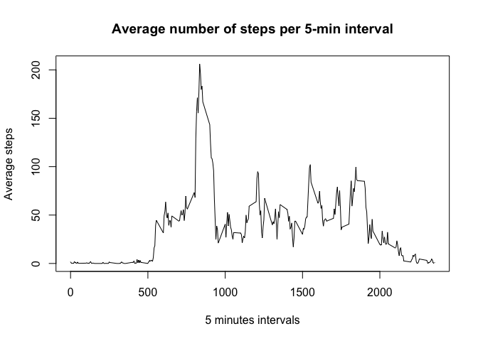
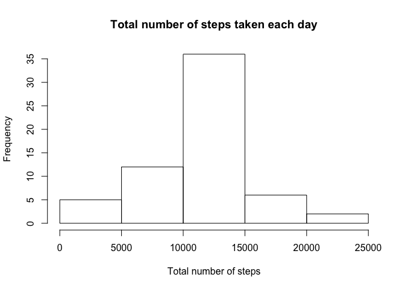
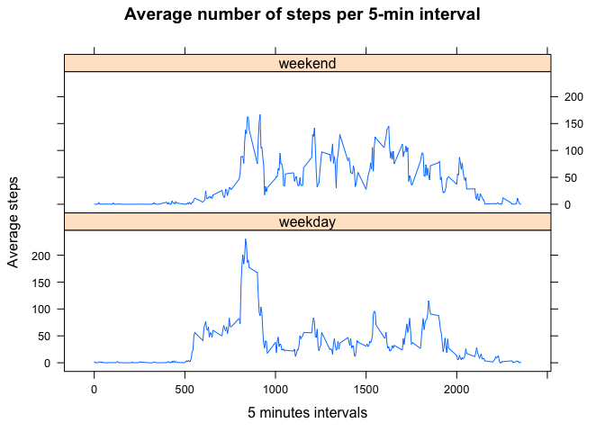

# Reproducible Research: Peer Assessment 1


## Required library

```r
require(data.table)
require(lubridate)
require(dplyr)
require(chron)
require(lattice)
require(knitr)
```

## Loading and preprocessing the data

```r
##  1. Code for reading in the dataset and/or processing the data
unzip("activity.zip")
dataset  <- "activity.csv"
df <- fread(
  dataset, header = T, na.strings = c("NA")
)

## Convert dates
df$date     <- ymd(df$date)
df$datetime <- ymd(df$date) + minutes(df$interval)
```

## What is mean total number of steps taken per day?

```r
# 2. Histogram of the total number of steps taken each day
daily_summary <- df[complete.cases(df),] %>%
  group_by(date) %>%
  summarise( total_steps = sum(steps))

hist( daily_summary$total_steps,
      main = "Total number of steps taken each day",
      xlab = "Total number of steps")
```

\

```r
# 3. Mean and median number of steps taken each day
df_avg_steps_day <- mean(daily_summary$total_steps)
df_median_steps_day <- median(daily_summary$total_steps)
```

 * **The average number of steps per day is**: 10766.19
 * **The median is**:10765

## What is the average daily activity pattern?

```r
# 4. Time series plot of the average number of steps taken
interval_summary <- df[complete.cases(df),] %>%
  group_by(interval) %>%
  summarise( avg_steps = mean(steps) )

plot(
  interval_summary$interval,
  interval_summary$avg_steps,
  type = "l",
  main = "Average number of steps per 5-min interval",
  xlab = "5 minutes intervals",
  ylab = "Average steps"
)
```

\

**The 5-minute interval that, on average, contains the maximum number of steps is**: 835
**with** 206.1698 **steps on average**.

## Imputing missing values
**Total number of missing values (i.e. NAs)**: 2304


```r
# 5. Code to describe and show a strategy for imputing missing data
complete_df <- merge(df, interval_summary, by = "interval")

# fill in missing values with interval average
complete_df$steps <-
  ifelse(
    is.na(complete_df$steps),
    round(complete_df$avg_steps),
    complete_df$steps
  )

# remove unneeded column
complete_df <- complete_df[,avg_steps := NULL]

# rearrange column order
setcolorder(complete_df, c("steps", "date", "interval", "datetime"))

# 4. Histogram of the total number of steps taken each day after missing values are imputed
daily_summary <-
  complete_df    %>%
  group_by(date) %>%
  summarise( total_steps = sum(steps))

hist(
  daily_summary$total_steps,
  main = "Total number of steps taken each day",
  xlab = "Total number of steps"
)
```

\

```r
df_avg_steps_day2 <- mean(daily_summary$total_steps)
df_median_steps_day2 <- median(daily_summary$total_steps)
```

 * **The average of steps per day for the filled-in dataset is**: 10765.64
 * **The median is**:10762


```r
diff <- matrix(
  c(df_avg_steps_day, 
    df_median_steps_day, 
    df_avg_steps_day2, 
    df_median_steps_day2,
    df_avg_steps_day - df_avg_steps_day2,
    df_median_steps_day - df_median_steps_day2
  ), 
  ncol=2, 
  byrow=TRUE
)
colnames(diff) <- c("Average steps per day","Median")
rownames(diff) <- c("Original DS", "Filled-in DS", "Difference")
diff <- as.table(diff)

kable(diff, digits=2, caption = "Table - Difference from the original dataset w/ NAs values and the filled-in one")
```


Table: Table - Difference from the original dataset w/ NAs values and the filled-in one

                Average steps per day   Median
-------------  ----------------------  -------
Original DS                  10766.19    10765
Filled-in DS                 10765.64    10762
Difference                       0.55        3

## Are there differences in activity patterns between weekdays and weekends?


```r
# 8. Panel plot comparing the average number of steps taken per 5-minute interval across weekdays and weekends

complete_df$weekday <-
  factor(
    ifelse(
      is.weekend(complete_df$datetime),
      "weekend",
      "weekday"
    )
)

interval_summary <-
  complete_df %>%
  group_by(interval, weekday)    %>%
  summarise( avg_steps = mean(steps))

xyplot(
  avg_steps ~ interval | weekday,
  data = interval_summary,
  pch=19,
  main= "Average number of steps per 5-min interval",
  xlab= "5 minutes intervals",
  ylab= "Average steps",
  layout=c(1,2),
  type=c("l","l")
)
```

\
